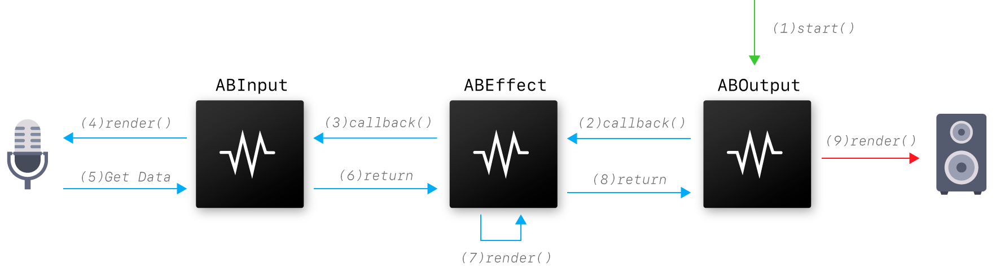

# AudioBox
SDK gratuito y de código abierto para desarrollar plugins de audio.

## Plataformas
* GNU/Linux
* Mac OS X
* Windows

## Tipos de Plugins
* Entrada
* Salida
* Efectos de Audio
* Generadores
* Panoramizadores
* Mezcladores
* Divisores
* Instrumentos MIDI
* Efectos MIDI

## Tipos de UI
* Apple Carbon
* Apple Cocoa
* X11
* Wayland
* Desktop Window Mannager

## Clases
* AudioBox
	* ABInput
	* ABOutput
	* ABDeviceOutput
	* ABEffect
	* ABGenerator
	* ABPanner
	* ABMixer
	* ABSplitter
	* ABInstrument
	* ABMidiEffect

## Secuencia del Procesamiento
Para poder procesar audio con unidades AudioBox es necesario contar con al menos una unidad de entrada de tipo **ABInput**, **ABGenerator** o **ABInstrument** y una unidad de salida de tipo **ABOutput** o **ABDeviceOutput**. 

La secuencia comienza al llamar el método **start()** de una unidad de **salida**. Esta le envía (por referencia) un buffer de audio a la unidad conectada a su bus de entrada, a travez de una función callback, permitiendole aplicar su propio procesamiento. Cuando finaliza, la función callback es retornada notificando a la unidad de salida que ya puede reproducir, almacenar o realizar otra operación con el audio.

De la misa forma, la unidad conectada puede compartir el buffer con unidades conectadas a sus buses de entrada y esperar el retorno de los callbacks, para luego realizar su propio procesamiento y enviarlo de vuelta a la unidad de salida.

Ejemplo con tres unidades: La unidad de salida solicita datos a la unidad de efecto, la unidad de efecto solicita datos a la unidad de entrada, la unidad de entrada retorna los datos capturados del micrófono a la unidad de efecto, la unidad de efecto aplica su propio procesamiento y retorna los datos a la unidad de salida, por último la unidad de salida se encarga de enviar el sonido al dispositivo de audio externo.
 
La condición de contar con una unidad de entrada y salida existe únicamente si se utiliza el método **connectBus()** para conectar los buses de entrada y salida entre unidades.

Es posible asignar los callbacks entre unidades manualmente, o a métodos definidos por el usuario utilizando el método **setCallback()**. Esto permite utilizar unidades directamente, sin necesidad de contar con una unidad de entrada y otra de salida.

## Frecuencia de Muestreo
La frecuencia de muestreo en el contexto de un proyecto, viene dada por la unidad de salida. Por ejemplo, si la unidad de salida funciona con una frecuencia de muestreo de 44.1 khz, el resto de las unidades deben trabajar con la misma frecuencia. Se debe llamar el metodo getAvaliableSampleRates() para obtener una lista con todas las frecuencias de muestreo soportadas por una unidad y el método setSampleRate() para asignar la frecuencia deseada.
## AudioBox

### Métodos

##### SampleRateList *getAvaliableSampleRates()
Retorna una lista con las frecuencias de muestreo soportadas por la unidad.

##### bool *setSampleRate(unsigned int fs)
Asigna una frecuencia de muestreo soportada por la unidad.

## MIDI Effect

## ABPanner

#### Entradas
1 entrada con la configuración dada por la salida de la unidad de entrada.
#### Salidas
1 salida con la configuración dada por la entrada de la unidad de salida.

## ABDivider
Este tipo de unidad permite dividir una señal de entrada y retornarla en varios outputs.

#### Entradas
1 entrada con la configuración dada por la salida de la unidad de entrada.

#### Salidas
N salidas con configuraciónes dadas por las entradas de las unidades de entrada.

## ABMixer

#### Entradas
N entradas con configuraciónes dadas por las salidas de las unidades de entrada.
#### Salidas
1 salida con la configuración dada por la entrada de la unidad de salida.

## ABGenerator
Este tipo de unidad no tiene buses de entrada y solo es capaz de generar sonido.

### Ejemplos
* Tone & Noise Generator
* File Reader Scheduler

#### Entradas
Sin entradas
#### Salidas
1 salida con la configuración dada por la entrada de la unidad de salida.

## ABEffect

##### void setBypassed(bool mode)
Ignora el procesamiento de la señal.

##### bool isBypassed()
Indica si el procesamiento de la es ignorado.

## ABOutput
Reproduce el sonido por el dispositivo seleccionado.

### Entradas
El número de entradas y sus configuraciones vienen dadas por las carácteristicas del dispositivo.
### Salidas
No contiene salidas.

##### BufferSizeList *getAvaliableBufferSizes()
Retorna una lista de tamaños de buffer asignables.

##### bool setBufferSize(int size)
Asigna el tamaño del buffer.

##### SampleFormatList *getAvaliableSampleFormats()
Retorna una lista con todos los formatos de sonido soportados por la unidad, más los nativamente soportados por el dispositivo.

##### bool setSampleFormat(SampleFormat format)
Asignal el formato de muestreo.

##### DeviceList *getOutputDevices()
Retorna una lista con todos los dispositivos de salida disponibles.

##### bool setOutputDevice(Device *device)
Asigna el dispositivo de salida. Al asignarlo, podría modificarse tambíen el tamaño del buffer, el formato de sampleo

##### BusList *getInputBuses()
Retorna una lista con la configuración de todos los buses de salida.
Para un dispositivo pueden ser canales mono independientes, pares stereo, u otros.

##### void play()
Comienza la reproducción de sonido.

##### void stop()
Detiene la reproducción de sonido.